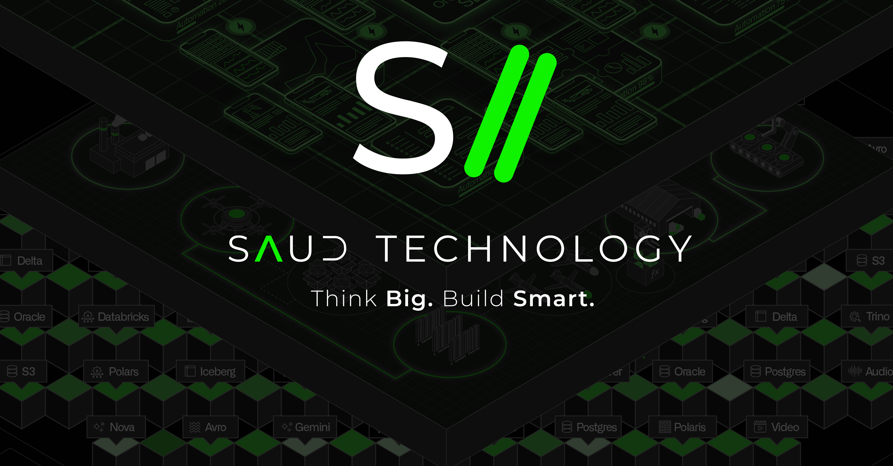

<strong>Think Big. Build Smart.</strong>

<strong>SAUD TECHNOLOGY</strong> represents the professional identity under which <strong>THIAGO SAUD</strong> operates on mission-critical platforms — the interface that the user visualizes and the system that runs it.

The focus of action focuses on the development of high reliability and high traffic digital systems - fintech, banks and regulated operations - where technical decisions directly impact latency, availability, security posture and business indicators.

<strong>Frontend:</strong> Architecture of web platforms, design systems and micro-frontends. Rendering and caching strategies, reliability standards in critical journeys, measurable performance (Core Web Vitals / Real User Monitoring), progressive delivery and user experience prepared for failures: elegant degradation and error isolation.

<strong>AI & MLOps:</strong> Model engineering in production, not just in the demonstration phase. Use of Python and Deep Learning; implementation of RAG and Agentic AI with LangChain / LangGraph; training cycle, registration, testing and observability with MLflow. The models go through the same rigorous release process as the interfaces - versioned, monitored and recoverable in case of failure.

The criterion of excellence is the same in both areas: platforms that remain fast, secure and operational as complexity increases.

<strong>Take your business to the next level with professional-quality software!</strong>

